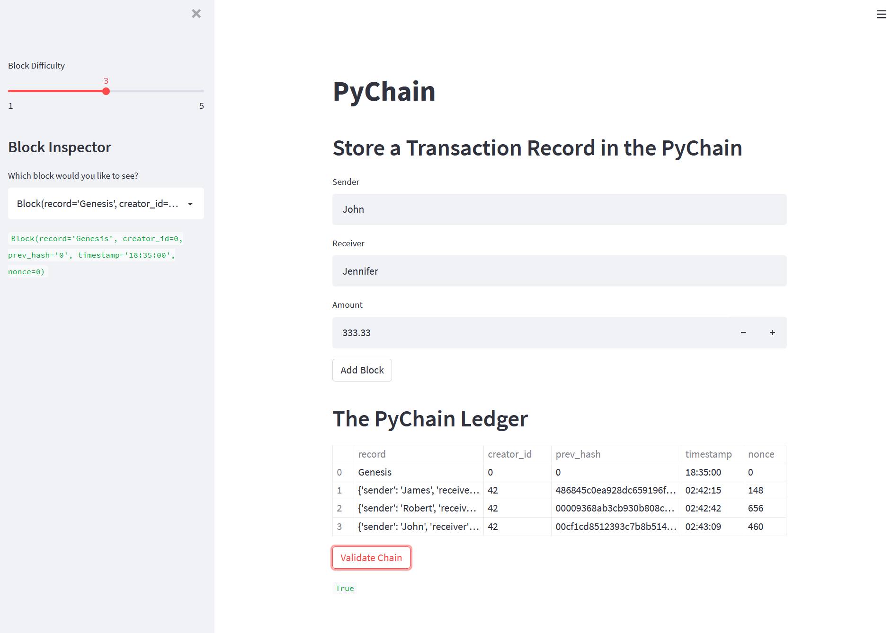

# Blockchain Ledger with Streamlit

The main goal of this project is to build a blockchain-based ledger system, complete with a user-friendly web interface. This ledger should allow partner banks to conduct financial transactions (that is, to transfer money between senders and recivers) and to verify the integrity of the data in the ledger.

---

## Example of the Streamlit Interface

The following image shows example of the PyChain. After enetering values for sender, receiver and amount in designed input area, you click the **Add Block** and a new block is stored in **The PyChain Ledger** below.
Underneath **The PyChain Ledger** you can see the result of validation of the chainthat is *True* that pops up after you click the **Validate Chain** button.



---

## Technologies

For this project we use the following tolls.

* [Python](https://www.coursera.org/articles/what-is-python-used-for-a-beginners-guide-to-using-python) - is a computer programming language often used to build websites and software, automate tasks, and conduct data analysis

* [conda](https://github.com/conda/conda) - cross-platform, language-agnostic binary package manager

* [pandas](https://github.com/pandas-dev/pandas) - is a Python package that provides fast, flexible, and expressive data structures designed to make working with "relational" or "labeled" data both easy and intuitive 

* [streamlit](https://docs.streamlit.io/library/get-started?msclkid=d0e4542fc41111ec998ac26c21f5a09b) for creating the user interface.

---

## Instalation Guide

Before running the application, you need to install:

```python
pip install streamlit
```

---

## Contributors

Author: Magdalena Svimberska
email: magdalena.svimberska@gmail.com

---

## License

GNU General Public License